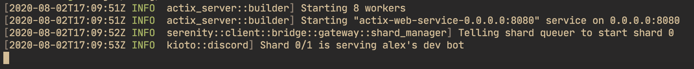

# Self-hosting

You're able to host your own instance of Kioto assuming that you have the resources. Really though, Kioto is _very_ lightweight; it shouldn't be too much of a hassle to host. For reference, this is an example of a working instance:



> Note that console commands aren't prefixed with `$`, etc. This is to allow you to easily copy them.

## Installing

### Building from source

Currently, pre-compiled Kioto binaries aren't available. First, [install Rust](https://www.rust-lang.org/learn/get-started). This is required to build Kioto. After that, you should be able to clone the repo:

```console
git clone https://github.com/fjah/kioto
```

`cargo` is required to build Kioto as it fetches metadata from the package config. This should be installed assuming that you correctly followed the Rust installation guide. Use it to build Kioto for release:

```console
cd kioto
cargo build --release
```

<small>Don't worry if your computer's fans start sounding like a jet engine. That's sorta just part of Rust life.</small>

#### Running

After building it, an executable should've been made in `target/release`:

```console
./target/release/kioto
```

This might be `./target/release/kioto.exe` on Windows systems.

You'll quickly realise that this throws a bunch of errors; you haven't made a config. See the next section for instructions on how to do that.

## Configuration

```console
cd config
cp default.hjson config.hjson
```

Open `config.hjson` in your editor and change the values to correspond with your environment. Kioto requires that a PostgreSQL DB is installed and running.
